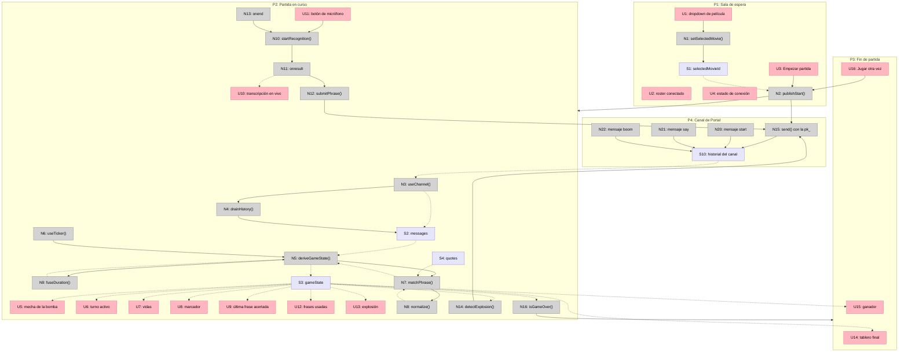

# Las locuras del emperador — bomba · Shaping

Ver [`frame.md`](./frame.md) para el problema y el outcome.

## Requirements (R)

| ID | Requirement | Status |
|----|-------------|--------|
| R0 | Dos personas juegan por voz a citar frases de una misma película, en vivo | Core goal |
| R1 | El clip se entiende sin audio y sin que nadie explique las reglas | Must-have |
| R2 | La partida deja un artefacto compartible sin filmar ni editar nada | Must-have |
| R3 | Construible en el orden de un día, no de una semana | Must-have |
| R4 | La tensión crece a lo largo de la partida en vez de reiniciarse en cada turno | Must-have |
| R5 | Los dos navegadores muestran el mismo estado sin que ninguno sea árbitro | Must-have |
| R6 | El juego se verifica automáticamente sin micrófono y sin red | Must-have |
| R7 | Quien se desconecta y vuelve recupera la partida exacta | Must-have |
| R8 | Se pueden sumar películas sin tocar código | Nice-to-have |

**Notas sobre el origen de las R:**

- R1, R2 y R3 son criterios que la usuaria fijó explícitamente antes de elegir la idea.
- R4 salió de reemplazar el reloj por turno (shape C) por la bomba global (shape D).
- R6 apareció al decidir que un loop automático de 4 horas tiene que poder verificar el
  producto: ninguna máquina le habla a un micrófono.
- R7 no es una aspiración de robustez: es consecuencia directa de no tener servidor.

---

## Shapes descartadas antes de fijar R0

Se exploraron dos productos distintos antes de que el problema se estabilizara. Se
registran acá como rastro de decisión, no entran al fit check porque preceden a R0.

| Shape | Título | Por qué se cayó |
|-------|--------|-----------------|
| **A** | Espejo de reacciones por cámara | Discord *stubea* `getUserMedia` en su fork de Electron, así que no puede ser un Activity; y el 90% del trabajo era detección facial con MediaPipe, no Portal. Choca con R3. |
| **B** | Shazam de frases ambiente, identificación por LLM | La usuaria eligió dataset local curado sobre identificación por modelo. Sin LLM desaparecen el servidor y la `sk_`, pero también la cobertura abierta. |

---

## CURRENT: chat de demostración sobre Portal

| Part | Mechanism | Flag |
|------|-----------|:----:|
| CURRENT1 | `PortalProvider` con cliente anónimo creado desde la `pk_` | |
| CURRENT2 | Un `useChannel` que expone mensajes, envío, historial, roster de presencia y typing | |
| CURRENT3 | Nombre de sesión elegido antes de entrar, pasado como `metadata` del frame de conexión | |

Es el punto de partida real del repo: prueba que el transporte funciona end-to-end, pero
no satisface ninguna R más allá de la conexión.

---

## C: Turnos con reloj fijo por turno

| Part | Mechanism | Flag |
|------|-----------|:----:|
| C1 | Turnos alternados con 15 segundos por turno | |
| C2 | El reloj se reinicia al empezar cada turno | |
| C3 | Vencido el turno, se pierde el turno sin penalización | |
| C4 | Estado de turno compartido por un cliente que hace de host | ⚠️ |

---

## D: Bomba con mecha global derivada del historial

| Part | Mechanism | Flag |
|------|-----------|:----:|
| **D1** | **Motor puro del juego** | |
| D1.1 | `deriveGameState(mensajes, ahora)` reduce el historial ordenado por `seq` al estado completo: turno, vidas, marcador, frases usadas y estado de la mecha | |
| D1.2 | El matching difuso ocurre **dentro** de la derivación, no antes de publicar: el cliente publica el texto crudo y la función pura decide si acertó | |
| D1.3 | La duración de la mecha se deriva por hash determinista del `id` del mensaje de arranque de ronda; el tiempo transcurrido se mide contra el `timestamp` del servidor de ese mensaje, nunca contra relojes locales | |
| D1.4 | Explosión resta una vida a quien tiene el turno y abre ronda nueva; a las 3 vidas termina la partida | |
| **D2** | **Transporte Portal** | |
| D2.1 | Antes de derivar, el cliente llama `loadPrevious()` hasta que `hasPrevious` sea falso: una partida supera el backfill de 50 mensajes por defecto y derivar sobre un historial truncado daría estados distintos en cada pantalla | |
| D2.2 | Tres tipos de mensaje persistentes en el canal: arranque de ronda con la película elegida, intento de frase con el texto crudo, y explosión | |
| D2.3 | Si los dos clientes detectan la explosión a la vez y ambos publican, la derivación toma el de `seq` más bajo e ignora el resto | |
| **D3** | **Adaptador de voz** | |
| D3.1 | Web Speech API con `lang: es-419`, modo continuo, relanzado desde `onend` porque Chrome corta a los ~60 s de silencio | |
| D3.2 | Toda la entrada pasa por `submitPhrase(text)`; el adaptador de voz es su único llamador en producción y los tests lo llaman directo | |
| **D4** | **Dataset** | |
| D4.1 | Frases agrupadas por película en una estructura de datos; sumar una película es agregar una entrada | |
| D4.2 | Normalización compartida por dataset y transcripción: minúsculas, sin acentos, sin puntuación, espacios colapsados | |
| **D5** | **Superficie visual** | |
| D5.1 | Bomba con mecha consumiéndose arriba, idéntica en las dos pantallas | |
| D5.2 | Turno activo, vidas restantes y marcador siempre visibles | |
| D5.3 | La frase acertada aparece en pantalla; paleta tematizada con la película | |
| **D6** | **Cierre de partida** | |
| D6.1 | Tablero final con todas las frases dichas, atribuidas a cada jugador | |
| D6.2 | Exportar el tablero como imagen descargable | ⚠️ |

---

## Fit Check

| Req | Requirement | Status | CURRENT | C | D |
|-----|-------------|--------|:-------:|:-:|:-:|
| R0 | Dos personas juegan por voz a citar frases de una misma película, en vivo | Core goal | ❌ | ✅ | ✅ |
| R1 | El clip se entiende sin audio y sin que nadie explique las reglas | Must-have | ❌ | ❌ | ✅ |
| R2 | La partida deja un artefacto compartible sin filmar ni editar nada | Must-have | ❌ | ❌ | ✅ |
| R3 | Construible en el orden de un día, no de una semana | Must-have | ✅ | ✅ | ✅ |
| R4 | La tensión crece a lo largo de la partida en vez de reiniciarse en cada turno | Must-have | ❌ | ❌ | ✅ |
| R5 | Los dos navegadores muestran el mismo estado sin que ninguno sea árbitro | Must-have | ❌ | ❌ | ✅ |
| R6 | El juego se verifica automáticamente sin micrófono y sin red | Must-have | ❌ | ❌ | ✅ |
| R7 | Quien se desconecta y vuelve recupera la partida exacta | Must-have | ❌ | ❌ | ✅ |
| R8 | Se pueden sumar películas sin tocar código | Nice-to-have | ❌ | ❌ | ✅ |

**Notas:**

- **CURRENT falla R0**: es un chat, no un juego. Sólo pasa R3 porque ya está construido.
- **C falla R1**: un temporizador por turno se reinicia y no produce escalada visible; el
  espectador no puede leer el estado del juego en una imagen fija.
- **C falla R2**: no acumula nada entre turnos, así que no queda registro de la partida.
- **C falla R4** por definición: el reloj se reinicia en cada turno.
- **C falla R5, R6 y R7 por C4**: designar un cliente como host es un mecanismo marcado
  como desconocido — hace falta elección de host y recuperación ante su caída, y ninguna
  de las dos está resuelta. Un flag no puede reclamar ✅.
- **D pasa R2 con D6.1 solo.** D6.2 está marcado ⚠️ y por eso no puede sostener ninguna
  ✅, pero el tablero final en pantalla ya satisface el requisito: se captura y se
  comparte sin editar.

**Shape seleccionada: D.**

---

## Detail D: Afordancias concretas

### Places

| # | Place | Description |
|---|-------|-------------|
| P1 | Sala de espera | Elegir película, ver quién está conectado, arrancar |
| P2 | Partida en curso | Bomba, turno, vidas, marcador, frases |
| P3 | Fin de partida | Tablero final con todas las frases dichas |
| P4 | Canal de Portal | Historial persistente de mensajes, ordenado por `seq` |

P1 → P2 y P2 → P3 son navegaciones reales: la pantalla entera se transforma y no se puede
interactuar con lo anterior.

### UI Affordances

| # | Place | Component | Affordance | Control | Wires Out | Returns To |
|---|-------|-----------|------------|---------|-----------|------------|
| U1 | P1 | lobby | dropdown de película | select | → N1 | — |
| U2 | P1 | lobby | roster de jugadores conectados | render | — | — |
| U3 | P1 | lobby | botón "Empezar partida" | click | → N2 | — |
| U4 | P1 | lobby | estado de conexión del canal | render | — | — |
| U5 | P2 | bomb | mecha consumiéndose | render | — | — |
| U6 | P2 | hud | indicador de turno activo | render | — | — |
| U7 | P2 | hud | vidas restantes por jugador | render | — | — |
| U8 | P2 | hud | marcador de frases acertadas | render | — | — |
| U9 | P2 | board | última frase acertada, con su autor | render | — | — |
| U10 | P2 | mic | transcripción en vivo de lo que oye el micrófono | render | — | — |
| U11 | P2 | mic | botón de micrófono | click | → N10 | — |
| U12 | P2 | board | frases ya usadas en la partida | render | — | — |
| U13 | P2 | bomb | animación de explosión | render | — | — |
| U14 | P3 | scoreboard | tablero final: frases agrupadas por jugador | render | — | — |
| U15 | P3 | scoreboard | ganador y perdedor | render | — | — |
| U16 | P3 | scoreboard | botón "Jugar otra vez" | click | → N2 | — |

### Code Affordances

| # | Place | Component | Affordance | Control | Wires Out | Returns To |
|---|-------|-----------|------------|---------|-----------|------------|
| N1 | P1 | lobby | `setSelectedMovie()` | call | → S1 | — |
| N2 | P1 | lobby | `publishStart()` | call | → N15, → P2 | — |
| N3 | P2 | portal | `useChannel({ channelId, history })` | observe | → N4 | → S2 |
| N4 | P2 | portal | `drainHistory()` — repite `loadPrevious()` hasta que `hasPrevious` sea falso | call | → S2 | — |
| N5 | P2 | engine | `deriveGameState(mensajes, ahora)` | call | → N7, → N9 | → S3 |
| N6 | P2 | engine | `useTicker()` — re-deriva con un `ahora` fresco cada frame | observe | → N5 | — |
| N7 | P2 | engine | `matchPhrase(texto, frases, usadas)` | call | → N8 | → N5 |
| N8 | P2 | engine | `normalize(texto)` — minúsculas, sin acentos, sin puntuación | call | — | → N7 |
| N9 | P2 | engine | `fuseDuration(idDelArranque)` — hash determinista a milisegundos | call | — | → N5 |
| N10 | P2 | mic | `startRecognition()` / `stopRecognition()` | call | → N11 | — |
| N11 | P2 | mic | `recognition.onresult` | observe | → N12 | → U10 |
| N12 | P2 | mic | `submitPhrase(texto)` — única entrada del juego | call | → N15 | — |
| N13 | P2 | mic | `recognition.onend` — relanza tras el corte de ~60 s de Chrome | observe | → N10 | — |
| N14 | P2 | engine | `detectExplosion()` — si la mecha venció y nadie publicó explosión, publica | call | → N15 | — |
| N15 | P4 | portal | `send()` con la `pk_` | call | → S10 | — |
| N16 | P2 | engine | `isGameOver()` — alguien llegó a 3 vidas perdidas | call | → P3 | — |
| N20 | P4 | channel | mensaje `start` con la película elegida | write | → S10 | — |
| N21 | P4 | channel | mensaje `say` con el texto crudo del micrófono | write | → S10 | — |
| N22 | P4 | channel | mensaje `boom` | write | → S10 | — |

### Data Stores

| # | Place | Store | Description |
|---|-------|-------|-------------|
| S1 | P1 | `selectedMovieId` | Película elegida en el dropdown, local hasta publicarse |
| S2 | P2 | `messages` | Historial completo del canal tras drenarlo, ordenado por `seq` |
| S3 | P2 | `gameState` | Derivado: fase, turno, vidas, marcador, frases usadas, estado de la mecha |
| S4 | P2 | `quotes` | Dataset de frases por película (configuración, sólo lectura) |
| S10 | P4 | Canal de Portal | Estado externo: los mensajes persistentes de la partida |

**Lecturas de los stores:**

- S1 → N2
- S2 → N5
- S3 → U5, U6, U7, U8, U9, U12, U13, U14, U15, N14, N16
- S4 → N7
- S10 → N3

### Wiring

**Lo que el wiring hace evidente:**

- **Todo entra por N12.** El micrófono es el único llamador en producción, y los tests
  llaman la misma función. Es la traducción literal de R6.
- **N5 es el único que escribe S3.** Turno, vidas, marcador, mecha y aciertos salen del
  mismo lugar, así que no pueden contradecirse entre sí.
- **N6 existe porque la mecha es tiempo, no evento.** Nada llega por la red cuando la
  bomba avanza: el estado cambia sólo porque `ahora` cambió. Sin el ticker, la bomba se
  vería congelada hasta el siguiente mensaje.
- **N14 escribe al canal leyendo S3**, que es lo que convierte una explosión local en un
  hecho compartido. El desempate por `seq` vive dentro de N5.

---

## Riesgos aceptados

| # | Riesgo | Por qué se acepta |
|---|--------|-------------------|
| 1 | Sólo Chrome desktop. Firefox tiene `SpeechRecognition` detrás de un flag; en iOS el modo continuo es inservible | Los dos jugadores son personas concretas en una llamada, no tráfico anónimo |
| 2 | Lo que no está en el dataset no existe | Decisión explícita: dataset curado sobre identificación por modelo |
| 3 | La duración de la mecha es inspeccionable desde la consola | Es un juego entre amigos; no hay adversario |
| 4 | El texto crudo del micrófono queda en el historial del canal | El canal es privado a la partida; se revisará si alguna vez es público |

---

## Sin resolver

- **D6.2** sigue marcado ⚠️: exportar el tablero como imagen requiere elegir mecanismo y
  probablemente una dependencia. No bloquea ninguna R.
- El umbral del matching difuso es empírico. El mecanismo está claro (normalizar y
  comparar), el número se calibra mirando transcripciones reales.
- Las 100 frases las aporta la usuaria. Se arranca con un subconjunto para poder correr.
